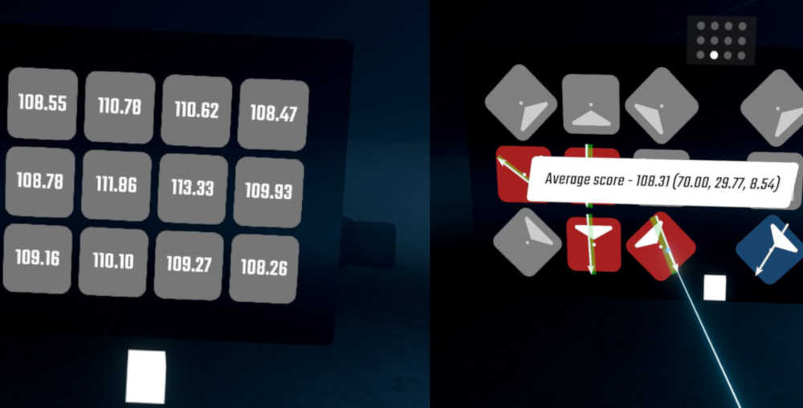

# SliceDetails

A Beat Saber mod that lets you view your average cuts per-note angle per-grid position in the pause menu and level completion screen.

Credit to ckosmic, the original author of the mod.

## Manual Installation
> [!IMPORTANT]
> In addition to BSIPA, you must have [SiraUtil](https://github.com/Auros/SiraUtil) and [BeatSaberMarkupLanguage](https://github.com/monkeymanboy/BeatSaberMarkupLanguage) installed for this mod to load. Install them using your mod manager.

### For Beat Saber v1.37.1

Place the contents of the unzipped folder from the latest [release](https://github.com/qqrz997/SliceDetails/releases/latest) into your Beat Saber installation folder. If you need more information regarding manual installation of mods [this wiki page](https://bsmg.wiki/pc-modding.html#manual-installation) will help. For further help with installing mods, join the [Beat Saber Modding Group](https://discord.gg/beatsabermods) discord server.

Older versions of the mod for older versions of the game are not supported. If you find issues using an older version then I won't be able to help.

## Configuration

All mod settings can be located from the main menu, go to settings, then go to mod settings, and then look for `SliceDetails`.
